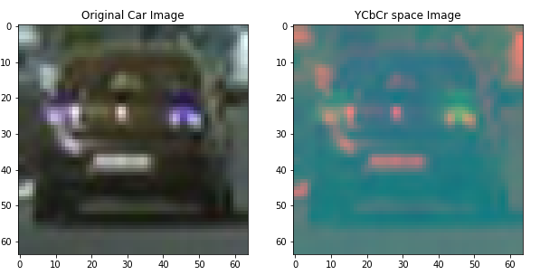
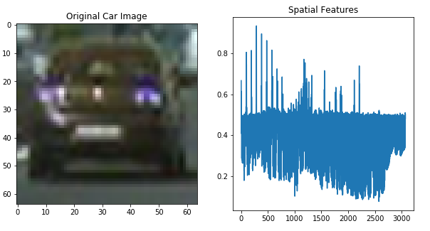
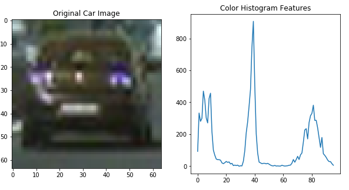
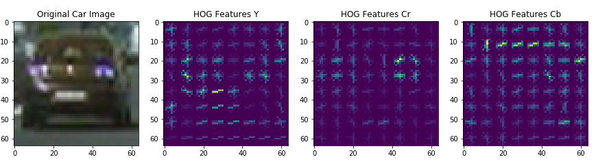

## Vehicle Detection

In this project, the goal is to write a software pipeline to identify vehicles in a video. The pipeline uses traditional computer vision and machine learning techniques whereby models are learned to detect whether a patch of image is a vehicle/car or not. Further technique discussed in the course is applied to optimize the execution pipeline in terms of search space and time.

The Project
---

The goals / steps of this project are the following:

* Extract features such as Histogram of Oriented Gradient (HOG), color histogram and spacial binning which are then used by classifier for training.
* Utilize traditional machine learning (SVM) to classify whether a feature vector is a car or not.
* For detecting car in an efficiently and timely manner, I only looked at certain areas of the image (road section only) where the cars can be 
* Used a sliding window approach which slides across the image with a fixed image patch to detect vehicles in that patch.
* Used a pixel incremental approach to smoothen the car detection and reduce false positives.
* Apply a perspective transform to rectify binary image ("birds-eye view").
* Warp the detected car boundries and display on the original image by drawing bounded rectangles.

### Scripts

* video_generation_pipeline.py: Script to generate the lane tracking video (requires image_processing_pipeline.py, tools_threshold_histogram.py, tools_drawing.py).
* image_processing_pipeline.py: Script utilized by video generation pipeline to detect cars in each image.
* feature_generation.py: Script used by image processing pipeline for extracting HOG, spatial and histogram features and generating a single vector.
* tools_drawing.py: Drawing tools for drawing boxes around cars in an image.
* classifier.py: Classifier scripts that trains a model using features to learn vehicle/non-vehicle images.
* project_output_color.mp4 : Car tracking output from the pipeline.
* project_video.mp4: Video used for testing lane tracking. 

### Feature Extraction

I utilized the YCrCb space image to generate spatial, color histogram and HOG features. Example of image projection is shown below:

 

Example of spacial, color histogram and HOG features is shown the figure below:

### Classification

I utilized Support Vector Machine (SVM) based classifier to classify vechicle vs. non-vehicle images. I divided the data into a 80-20 ratio and also performed a 10 fold cross validation to check for overfitting. The accuracy on training and testing on a single split of 80-20 was 99.16% where as the 10-fold cross validation was 99%.

### Vehicle Search

To search the cars the pipeline segments the image and so that search is made in the regions were car can potentially be present. The pipeline also starts with a search path of 64x64 image and increments the patch size by 16 pixels.

To reduce the number of false positives, I kept a buffer of 5 frames. The vehicle location estimation are made based on the heatmaps generated from 4 temporal and 1 current image frames. To reduce the effect of car estimation of previous frame the pixels of heatmap were set to zero for all pixels with values less then or equal to 3. 

Example of heatmap generated for detected vehicle is shown in below:

Thanks to the lecture notes a lot of functionality required for pipeline were written while going through the lecture.

### Results

* The video of the pipeline which detects the vehicle can be found 

### Self Reflection

Its been a fun working on this project and it has greatly improved my skills and understanting of computer vision and techniques that can be utilized for a variety of problems that I am dealing with different research projects. 

Lots of further tweaking can be done in this project but in wake of time limitation I had to restrict my experimentations. 

As part of future extention I will be working on the following problems:
* Merging the pipeline of project 4 and 5 so that both lane and vehicle tracking can be done togather.
* Extend vehicle detection project to also other objects in the image such as pedestrian/trees/traffic signs and rather then classifying vehicle/non-vehicle the classifier can be extended to vehicle/pedestrian/trees/traffic signs/non-vehicle etc. This can eventually lead to my entry in the Udacity car challenge. 
